## Coconut

There are even rules in programming. If you do not follow them, it can happen that an exception occurs or that you fall from the bridge of death into the volcano. Fix the binary and master the path to find the Holy Grail.

## Description

Over the last few months, we observed an increase of malware or packers that are written in Go. Reverse engineering of Go programs is not always easy, since Go binaries are statically linked and contain a lot of library code, and also use many peculiarities such as a different calling convention or a different storage method for strings. However, there are good open-source tools that can help with the analysis. In this particular challenge, several malware anti-analysis techniques are used to make debugging a bit more difficult. These need to be circumvented to find out what adjustments need to be made to the binary to get the correct flag.

## Solution

Tools that were used to solve this challenge:
- IDA
- x64dbg
- GoReSym

When executing the program, we only get two lines of text that is not very helpful at the moment.

As Go binaries are statically linked, it contains a lot of library code. If we would simply debug the program now, we would most likely not find the main function that easy and debug library code instead. To take a shortcut we use a program called `GoReSym`. This gives us all the main function, their start address and their full name. 
An important note here: `GoReSym` currently only supports up to Version 1.20. Our program was however written in Go v1.21 which means that we have to supply the specific version number to get the complete output. The following command gives us the full output:

`./GoReSym.exe -t -d -p -v 1.20 coconuts.exe > coconuts_symbols.json`

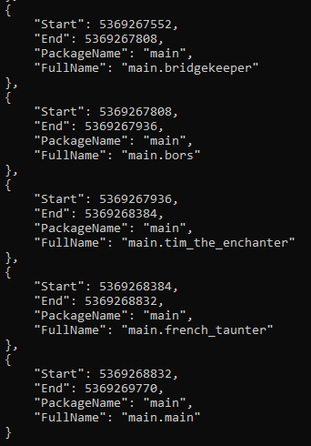

In `IDA` we now load the symbols with `goresym_rename.py` and search for the main_main function.

At this stage we can see that an input is compared to the string `Sir Lancelot of Camelot`. Digging a bit deeper we figure out that this is actually the command line argument. Supplying this string as argument we get another output.
In fact we see that the binary crashes.

To analyse what happens, we should probably drop the binary into a debugger such as `x64dbg`. To assist our analysis we further analyse the functions in `IDA` to get a better overview. Here we have an example of a function which is called in multiple steps. This should help to understand how the final function is executed. The actual function is hidden in the structure highlighted in the image.

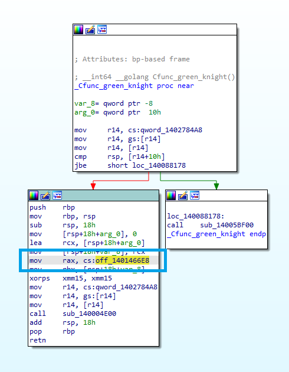

This structure then references another function.

Digging into this function we can see multiple calls. Looking at all the calls we can finally find the code we are looking for. In this case it's the second call.

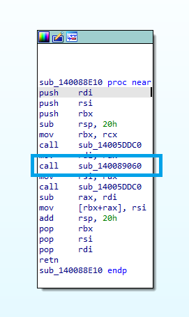

Here we have the final function. We can see that this function is most likely implementing an anti-analysis technique. It loads `ntdll.dll` and resolves the function `NtQueryInformationProcess` which is used later in the function.

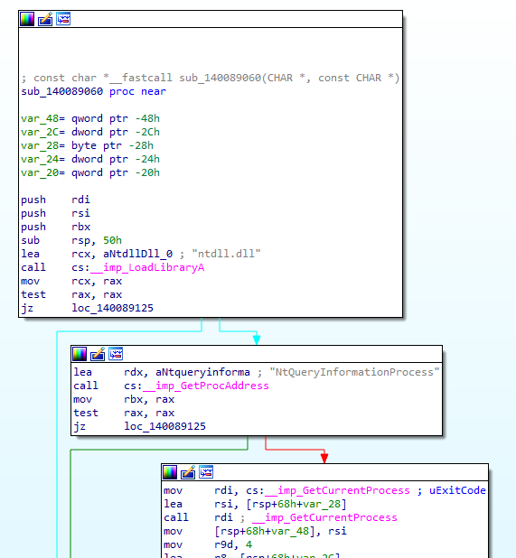

Jumping into the debugger it's best to set a breakpoint on the main function and then on all the functions we want to have a closer look at. From our analysis in `IDA` we know that `LoadLibary` will be called. Therefore this is also a good function to set a breakpoint on.
When we check our anti-analysis function we can see that indeed the program checks for an attached debugger via `ProcessDebugPort`.

We circumvent this anti-analysis technique and go on with our analysis. As we still want to find the exception we let the program run and figure out that the exception is actually triggered through `RaiseException`.  Debugging further through the exception we figure out that the program recovers from the exception but triggers a second one using the same function. At this stage the program cannot recover and crashes. It very much looks like those exceptions were triggered on purpose.

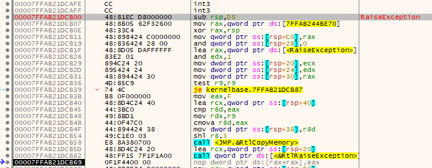

So we want to figure out where those `RaiseException` were called. Around this specific position we can see a few other interesting calls. Most interestingly we find a `strcmp` which then leads to a conditional jump. If the strings are equal, then the second exception is triggered and the program crashes. This means that this string must somehow be changed at some point to circumvent the second exception and keep the program running.

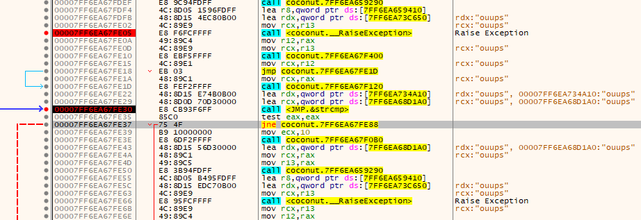

To find out where this string is used, we go back to `IDA`. Here we can jump to the exact code stage and find all references to both strings. One string seems to stay the same. This is most likely the comparing string. The other string has multiple references. One of those references is actually in another function. Therefore we want to have a closer look what this function does and where this function is called.

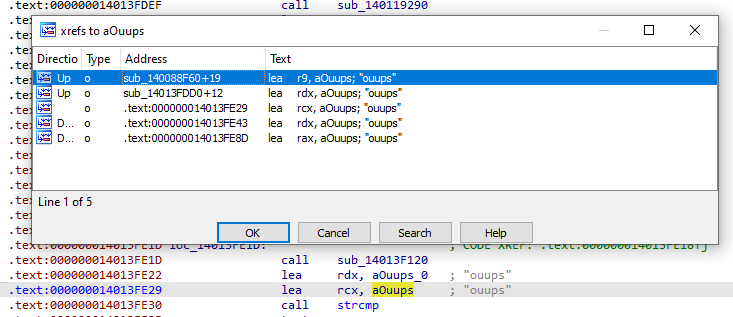

Looking for the cross references of this function, we see that this function is actually added as `VectoredExceptionHandler` in yet another function.

Tracing this function to its initial call, we figure out this the function is actually never called. So basically we know that a function, that would change the string and circumvent the second `RaiseException` call is a `VectoredExceptionHandler` which is never added. 
To fix that problem, we have to make a call to this specific function somewhere.

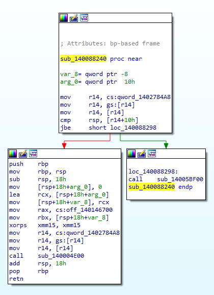

Browsing through the main function we can also find a perfect spot for that. We can find a very weird section which only consists of `nop` instructions. In fact the amount of `nop` instructions corresponds to the exact size a call instruction takes.

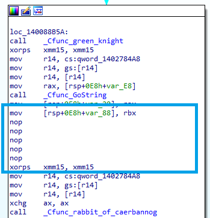

The function which adds the `VectoredExceptionHandler` can also be found in the `GoReSym` output which we can use to calculate the offset and modify the call instruction.

All we have to do now is to figure out how the call looks like. Best we just copy another call instruction from further down in the program, calculate the offset of the two functions and modify the call instruction. Now we can patch with `E8 B4 F6 FF FF`.

Now that we added the call instruction we want to execute the program again and break in the exception handler. Executing the handler we can see that the initial string was now modified and says `rul35`. Therefore the strings are not equal anymore and the exception is not triggered a second time.

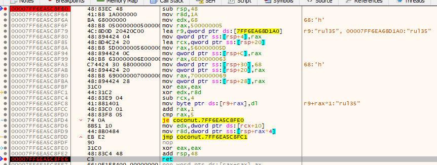

We however do not get the flag yet. There are a few more steps to follow. Just a function further down we have another implementation of an anti-analysis technique. In this case the program gets the offset of the `PEB`, checks for the flag `BeingDebugged`. 

After circumventing this function we get to a function that seems to resolve the filename of the binary. This filename is then compared to a string `the_holy_grail.exe`.  If they match, they return another part of the flag. His can either be solved by modifying the filename in the debugger or by simply changing the filename and restart the debugging session.

Back in the main function we see yet another function call. This function gets us the current system time.

The system time is used as an argument to another function call which compares it to another date. As they do not match initially, no flag is returned. To figure out what's exactly happening in the function we check back in `IDA`. Here we see two `hex` strings that are `xor-ed` This is not the first time the function `bridgekeeper` is executed and if we saw that before we should know that this is a simple `xor` function.

Using `CyberChef` to calculate the `xor` of those two strings (`754e5253486647725667` and `447765666556725f6452`) we find the date that is compared to our system time. Interestingly at this date `1975-05-25` the movie `Monty Python and the Holy Grail` was released. What a coincidence. 

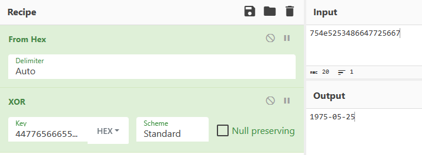

Now either we set the system time to this specific date or we patch the debugging binary to match this specific date. Using `PowerShell` we can simply change to system time to this specific date. In some cases the system call does not return the same date due to an edge case, therefore you might need to check the following date as well (`Set-Date -Date 1975-05-25` and remember to run as Administrator!).

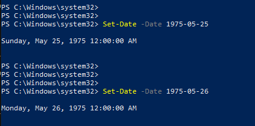

Now we reached the final stage. We circumvented all the anti-analysis techniques and conducted the following three tasks:
- Patch the binary to add the `VectoredExceptionHandler`
- Change the filename to `the_holy_grail.exe`
- Change to system time to `1975-05-25` or `1975-05-26`

Executing the binary now with the correct command line argument finally gives us the correct flag:

`csawctf{f0ll0w_7h3_c0d1ng_rul35_my_fr13nd}`
